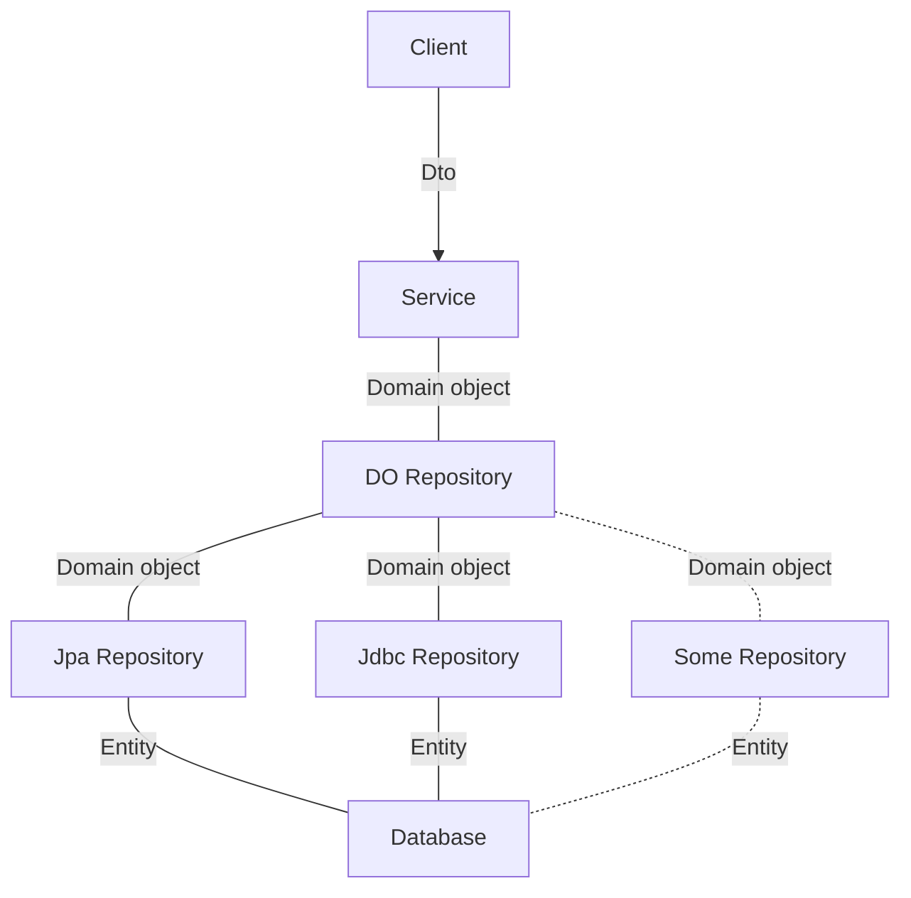

# Springboot template

SpringBoot 기반 서버 구현을 위한 템플릿입니다.

### Flow

```mermaid
flowchart TB
  Client --->|Dto| Service
  Service ---|Domain object| DORepository[DO Repository]
  DORepository ---|Domain object| JpaRepository[Jpa Repository]
  DORepository ---|Domain object| JdbcRepository[Jdbc Repository]
  DORepository -.-|Domain object| SomeRepository[Some Repository]
  JpaRepository ---|Entity| Database
  JdbcRepository ---|Entity| Database
  SomeRepository -.-|Entity| Database
```